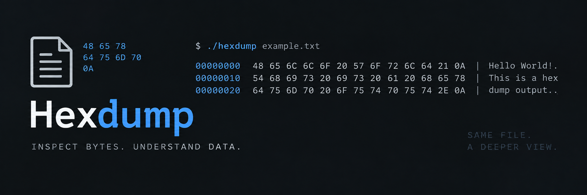

<p align="center">
  
</p>

<p align="center">
  A tiny, dependency-free hex viewer written in C.
  <br>
  <strong>Same file. A deeper view.</strong>
</p>

<p align="center">
  
  
</p>

## What is this?

`hexdump` opens a file as raw bytes and prints it 16 bytes at a time, showing:

- the byte offset
- each byte in hexadecimal
- the printable characters beside it

I was curious about C—how files, buffers, and bytes actually work—so I built this overnight. It is small on purpose: one source file, no libraries, and a direct look at what is sitting on disk.

```text
00000000 48 65 6C 6C 6F 20 57 6F 72 6C 64 21 0A 48 65 6C Hello World!Hel
00000010 6C 6F 20 57 6F 72 6C 64 21 0A lo World!
```

## Build

All you need is a C compiler:

```sh
cc hexdump.c -o hexdump
```

## Use

Pass in any file you want to inspect:

```sh
./hexdump <filename>
```

For example:

```sh
./hexdump test.txt
```

## How it works

1. Opens the target file in binary mode.
2. Reads up to 16 bytes into a buffer.
3. Prints the current offset and each byte as two-digit hex.
4. Prints the readable characters from the same block.
5. Repeats until it reaches the end of the file.

## Project layout

```text
.
├── assets/
│   └── hexdump-header.png
├── hexdump.c
└── test.txt
```

---

<p align="center"><sub>Built from curiosity, one byte at a time.</sub></p>
